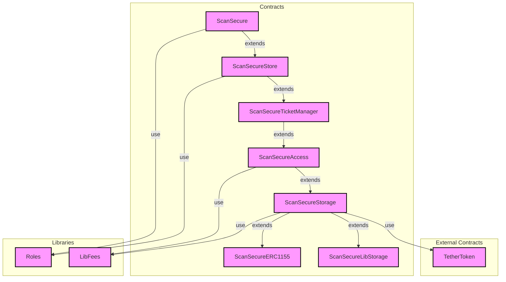
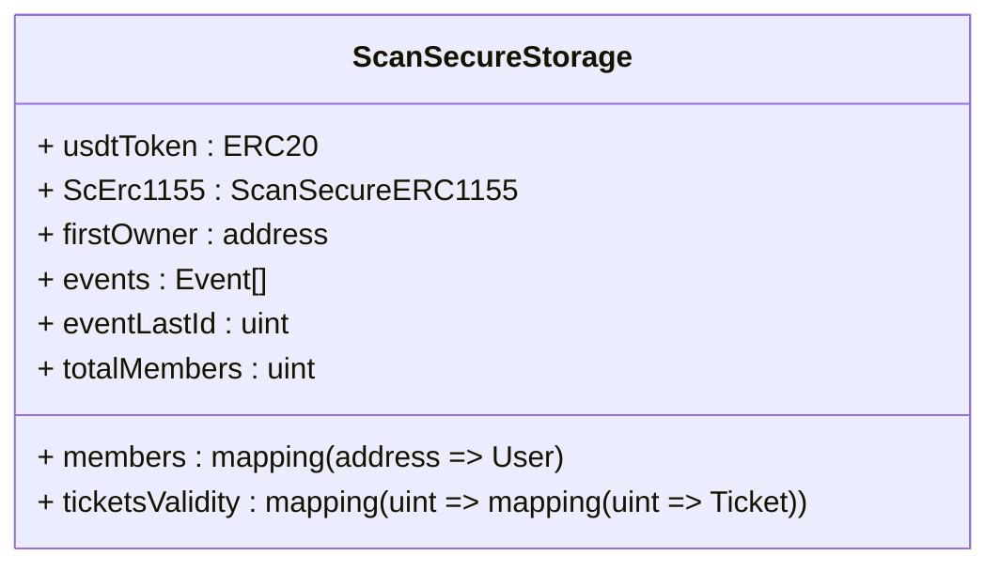
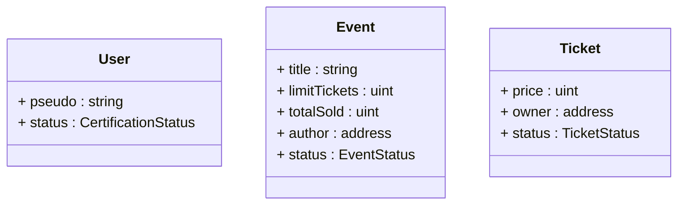

# ScanSecure

## Information

(in progress)
## Video Présentation

[Lien vers la vidéo (In progress)](http://oopsy.com)

## Website Demo (Vercel)

[Lien vers la demo](https://scan-secure-dapp.vercel.app/)

___

## Install

```sh
git clone https://github.com/xdrkush/ScanSecure.git
cd ScanSecure.git
yarn
```

## Run

#### DApp

!!! | More Information commands in package.json or docs

###### Dev

```sh
yarn dapp:dev
```

###### Build

```sh
yarn dapp:build
```

###### Start

```sh
yarn dapp:start
```


#### Contract

!!! | information commands in package.json or doc (npx hardhat ... -> in ./packages/hardhat-project)

###### Test

```sh
yarn sc:test
```

###### Coverage

```sh
yarn sc:coverage
```

###### Deploy (local)

```sh
yarn sc:deploy:local
```

###### Deploy (Sepolia)

```sh
yarn sc:deploy:sepolia
```

#### Script

!!! | Warning with uncomment all

###### Dev

```sh
yarn script:dev
```

###### Start

```sh
yarn script:start
```

___

## UserStories

`Objectives`: dApp for creating/selling tickets in NFT form

`Roles`: Ux Visitor (VI), Whitelisted (WL), Creator (CR), Admin (ADM):

 - Ux (VI) can register in a whitelist
 - The ux (VI) can request certification (CR) with a message (onchain)
 - The ux (ADM) can certify certification requests
 - The ux (CR) can create event(s)
 - The ux (CR) can create ticket collections (nft) for its events
 - The ux (WL) can obtain tickets proposed by a creator
 - The ux (CR) can verify/consume the ticket for stamping

Ideas for improvement:

 - Marketplace: Ticket sales between Uxs, ...
 - USDT: Link ticket sales in USDT, ...
 - DAO: Votes for certified users, ...

Lexicon:

 - Ux: User
 - dApp: Decentralized application

___

## Contracts

This repository contains a set of smart contracts for the ScanSecure application.

### Contracts Overview

#### ERC20 Token Contract - TetherToken.sol

A simulator ERC20 (USDT) for ScanSecure. This contract is used to simulate a USDT token within the application.

#### ERC1155 Token Contract - ScanSecureERC1155.sol

An ERC1155 token contract that allows the creation and management of event tickets.

#### Library Contract - LibFees.sol

A library contract providing a function to calculate fees based on a given price.

#### Library Contract - ScanSecureLibStorage.sol

A library contract containing various data structures and enums used in the ScanSecure application.

#### Contract - ScanSecure.sol

The main contract of the ScanSecure application. It serves as the entry point for the application and is responsible for managing access and user certification.

#### Contract - ScanSecureAccess.sol

A contract that extends the ScanSecureStorage contract and provides functions for user registration and certification.

#### Contract - ScanSecureStorage.sol

A contract that extends the ScanSecureLibStorage contract and provides storage for events, members, and tickets.

#### Contract - ScanSecureTicketManager.sol

A contract that extends the ScanSecureAccess contract and provides ticket management functionalities, including ticket creation, purchase, and consumption.

### Contract Relationships

The diagram below shows the data relationships between the main contracts in the ScanSecure application.





### Data Relationships

The diagram below shows the data relationships within the ScanSecureStorage contract:





## Structure of data Relationships

The diagram below shows the structure of data relationships within the ScanSecureStorage contract:




## Roles

`MEMBER_ROLE`=0x829b824e2329e205435d941c9f13baf578548505283d29261236d8e6596d4636
`CREATOR_ROLE`=0x828634d95e775031b9ff576b159a8509d3053581a8c9c4d7d86899e0afcd882f
`ADMIN_ROLE`=0xa49807205ce4d355092ef5a8a18f56e8913cf4a201fbe287825b095693c21775

___

### Docs

##### Multiple doc for Front:

 - [Raibowkit](https://www.rainbowkit.com/)
 - (front & back) [Wagmi](https://wagmi.sh/)
 - [WalletConnect](https://walletconnect.com/)
 - [Vercel](https://vercel.com/)
 - [NextJS](https://nextjs.org/)
 - [Chakra-UI](https://chakra-ui.com/)
 - (front & back) [Viem](https://viem.sh/)


##### Multiple doc for Back:

 - [Hardhat](https://hardhat.org/)
 - (front & back) [Infura](https://infura.io/)
 - [Etherjs](https://docs.ethers.org/v5/)
 - [Solidity](https://docs.soliditylang.org/fr/latest/index.html)
 - [Chai](https://www.chaijs.com/)
 - [Mocha](https://mochajs.org/)


##### Multiple doc for Environment:

 - [Workspace npm](https://docs.npmjs.com/cli/v7/using-npm/workspaces)


___

###### By [xDrKush](https://github.com/xdrkush)


+ info in ./package.json
# Address dev hardhat

`Account #0`: 0xf39Fd6e51aad88F6F4ce6aB8827279cffFb92266 (10000 ETH)
`Private Key`: 0xac0974bec39a17e36ba4a6b4d238ff944bacb478cbed5efcae784d7bf4f2ff80

`Account #1`: 0x70997970C51812dc3A010C7d01b50e0d17dc79C8 (10000 ETH)
`Private Key`: 0x59c6995e998f97a5a0044966f0945389dc9e86dae88c7a8412f4603b6b78690d

`Account #2`: 0x3C44CdDdB6a900fa2b585dd299e03d12FA4293BC (10000 ETH)
`Private Key`: 0x5de4111afa1a4b94908f83103eb1f1706367c2e68ca870fc3fb9a804cdab365a

`Account #3`: 0x90F79bf6EB2c4f870365E785982E1f101E93b906 (10000 ETH)
`Private Key`: 0x7c852118294e51e653712a81e05800f419141751be58f605c371e15141b007a6


___

###### By [xDrKush](https://github.com/xdrkush)
